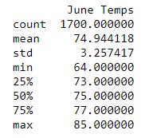
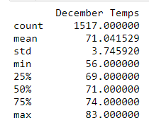

# Surf's Up - An Analysis in Support of an Ice Cream Surf Shop in Oahu; or, How I Learned to Stop Worrying and Love The Data

## Overview of the Analysis
Potential investors had questions on the business model for the proposed surf shop and ice cream parlor combination. Both are weather dependent businesses, and if the weather is not right for it enough of the year, the business will struggle. We looked at a target warm month (June) and a target potentially cold month (December) to get a sense of the high and low points of the weather for the business.

## Results

### June

* The mean temperature in June is 74 degrees F. This is good, acceptable temperature for ice cream.
* Even including nightime data, the minimum temperature obseved over years in June is 64, with only 25% of observations falling below 73. The lows of June are not very low, and are unlikely to drive off customers except off business hours, and perhaps occasional cold periods where ice cream is not desirable. Still, surfing is likely to continue
* The max temperature is 85, with 25% of data points above 77; there will be hot days in June, where potential customers are driven even more to the beach

### December 

* The mean temperature in December is 71, lower than in June, but still good outdoor weather for surfing, and we will still likely recieve some customers for ice cream.
* The min temperature in December is lower, down at 56, but 75% of results are still above 69 degrees. Even in a cold month like December, the temperature does not often fall too low, and it should still be infrequently a problem for the business.
* The max in December is 83, meaning there are still hot days and times in December where ice cream, surfing, and the beach will still be very appealing. This is not a business that is likely to need to take the cold months off.
* June's standard deviation is 3.26, while December's is 3.75. While December does vary more, neither are very high standard deviations, and it should lend a reliability to ice cream and surfing, two businesses that can be very temperature dependent. 

## Summary

### Conclusions
The temperature data analyzed here suggests that this is a good place for this business; warm to hot temperatures year round, and a relatively low standard deviation in temperatures suggest that we will not fall prey to temperature dependent issues often, and that we should be able to operate at this location year round.

### More Queries Possible

* This is a temperature dependent business, but also weather; people are less likely to be at the beach looking for surfing and ice cream in the rain. We could do additional queries on the same data to look at rainfall patterns, to better understand another vector that may cause slow periods for this potential business.
* We could also pull in data from across the year, rather than two targeted months, as we are introducing bias and assumption by targeting June and December as representative months. Places like San Francisco have weather and temperature patterns that do not follow the worldwide norm of the seasons, and either looking at more months, or looking at the full data set in this analysis could help eliminate that possibility. 
* It is worth noting that both of these above questions were looked at in part in previous analysis, and the data exists in the same data set.
